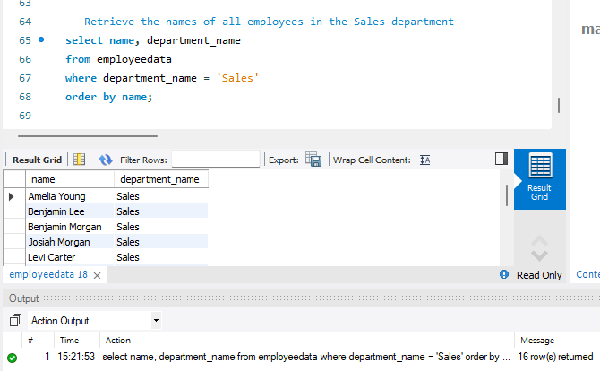
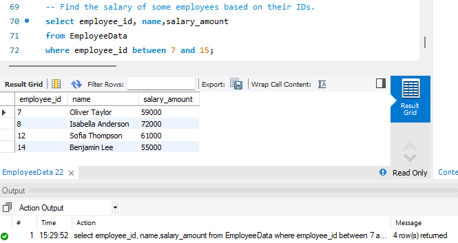

# Employee Data Analysis


---

## Introduction

Welcome to the **Employees Information Dataset Analysis** project where I will showcase different levels of SQL knowledge by working with an employees’ information dataset. 
In this project, I will start from the creation of the database itself, and progress through various SQL operations to effectively manipulate and analyse the employee data. 

**_Disclaimer_** : _All Datasets and reports do not represent any company, institution, or country, but just a dummy dataset to demonstrate capabilities of SQL_

## Problem Statement
1.	Create am Employees_Information Database
2.	Create 3 tables in the database Employees, Departments, Salaries with their corresponding values.
3.	Delete the start_date and end_date columns in the SALARY table.
4.	Where the employee_id is 9, 10 and 11, update the department_id to ‘4’.
5.	Combine the employees’ dataset with a separate dataset containing information about departments and salary to retrieve department names alongside employee records and salaries.
6.	Calculate the total number of employees in this company?
7.	How many employees were hired in the year 2023?
8.	What is the average salary for employees in each department?
9.	How many employees are there in each department?
10.	What is the highest salary earned by an employee?
11.	What is the lowest salary earned by an employee?
12.	How many employees were hired each year?
13.	How many employees were hired each month?
14.	Who are the department heads and their corresponding departments?
15.	Retrieve the names of all employees in the Sales department.
16.	Select employees whose salary is above 60000

## Skills/concepts demonstrated:
The following SQL knowledge were demonstrated:
- Database creation, 
- Data Import, 
- Data Retrieval, 
- Data Filtering, 
- Data Aggregation, 
- Data Modification, 
- Data Joins

## The goals of this project were

1. **Database Creation** : Design and create the database structure to store the employees’ information. Define appropriate tables, columns, and data types based on the information requirements. For example:
- Create an Employees_Information Database
```ruby
CREATE DATABASE employees_information;
```


- Create 3 tables in the database Employees, Departments, Salaries with their corresponding  values
```ruby
CREATE TABLE employees (employee_id INT, name VARCHAR(50), email VARCHAR (50), 
	phone_number VARCHAR(10), hire_date VARCHAR(20), department_id INT);
```


```ruby
CREATE TABLE salaries (salary_id INT, employee_id INT , salary_amount FLOAT, 
start_date VARCHAR (20), end_date VARCHAR (20));
```


```ruby
CREATE TABLE departments (department_id INT, department_name VARCHAR (100), department_head VARCHAR (50));
```


2. **Data Modification**: Use SQL statements to modify the dataset and update records. For example
- Delete the start_date and end_date columns in the SALARY table
```ruby
Alter Table salaries
Drop column start_date, 
drop column end_date;
```


- Where the employee_id is 9, 10 and 11, update the department_id to ‘4’
```ruby
Alter Table salariesupdate employees
set department_id =4
where employee_id between 9 and 11;
```


3. **Data Joins** : Perform SQL joins to combine information from multiple tables if applicable. For example:
- Combine the employees’ dataset with a separate dataset containing information about departments and salary to retrieve department names alongside employee records and salaries.
```ruby
select EMP.employee_id,EMP.name,EMP.email,EMP.phone_number,EMP.hire_date,
       DEP.department_id,DEP.department_name,DEP.department_head,SAL.salary_id,SAL.salary_amount
from employees as EMP
	     INNER join salaries as SAL
       on SAL.employee_id = EMP.employee_id
       INNER Join departments as DEP
       on EMP.department_id=DEP.department_id
 order by employee_id asc;
```


4. **Data Aggregation**: Perform SQL aggregation functions to obtain meaningful insights from the dataset. For example:
-  Calculate the total number of employees in this company.
```ruby
select count(employee_id)
from employees;
```


- How many employees were hired in the year 2023?
```ruby
select year(hire_date) as Year, count(year(hire_date)) as NumOfEmployeeHired
from employees
where year(hire_date) = '2023'
group by year(hire_date);
```


- What is the average salary for employees in each department?

_Firstly, I created a temporary table (EmployeeData) from the result of joining the three tables using **Inner Join**_
```ruby
CREATE TEMPORARY TABLE EmployeeData  
select EMP.employee_id,EMP.name,EMP.email,EMP.phone_number,EMP.hire_date,
       DEP.department_id,DEP.department_name,DEP.department_head,SAL.salary_id,SAL.salary_amount
from employees as EMP
	     INNER join salaries as SAL
       on SAL.employee_id = EMP.employee_id
       INNER Join departments as DEP
       on EMP.department_id=DEP.department_id
order by employee_id asc;
```


_Secondly, I used the new table name Employee data to extract the information_
```ruby
select avg(salary_amount) as AverageSalary, department_name
from EmployeeData
group by department_name;
```


- How many employees are there in each department?
```ruby
select count(name) as NumOfEmployees, department_name
from EmployeeData
group by department_name;
```


- What is the highest salary earned by an employee?
```ruby
select max(salary_amount)
from Employeedata;
```


- What is the lowest salary earned by an employee?
```ruby
select min(salary_amount)
from Employeedata;
```


- How many employees were hired each year?
```ruby
select count(year(hire_date)) as NumOfEmployees, year(hire_date) as HireYear
from EmployeeData
group by year(hire_date);
```


- What is the total salary expense for each department?
```ruby
select sum(salary_amount) as TotalSalary, department_name
from EmployeeData
group by department_name; 
```


- How many employees were hired each month?
```ruby
select count(date_format(hire_date, '%M')) as NumOfEmployees, date_format(hire_date,'%M') as Hiremonth
from EmployeeData
group by date_format(hire_date,'%M');
```


5. **Data Retrieval**: Write SQL queries to extract specific information from the dataset. For example:
- Who are the department heads and their corresponding departments?
```ruby
select department_name, department_head
from EmployeeData
group by department_name, department_head;
```


- Retrieve the names of all employees in the Sales department.
```ruby
select name, department_name
from employeedata
where department_name = 'Sales'
order by name;
```


- Find the salary of some employees based on their IDs.
```ruby
select employee_id, name,salary_amount
from EmployeeData
where employee_id between 7 and 15;
```


5. **Data Filtering** : Utilize SQL’s filtering capabilities to narrow down the dataset based on specific criteria. For example:
- Select employees whose salary is above 60000
```ruby
select *
from EmployeeData
where salary_amount > 60000;
```


- Filter employees by department to focus on salary amount > 60000
```ruby
select * 
from EmployeeData
where department_head = 'Sarah Thompson' and salary_amount > 60000;
```

## Conclusion 😄
I progressively demonstrated SQL proficiency, starting from basic queries and gradually advancing to more complex and comprehensive analysis. This allowed me to showcase the versatility and power of SQL as a tool for data manipulation and analysis.
